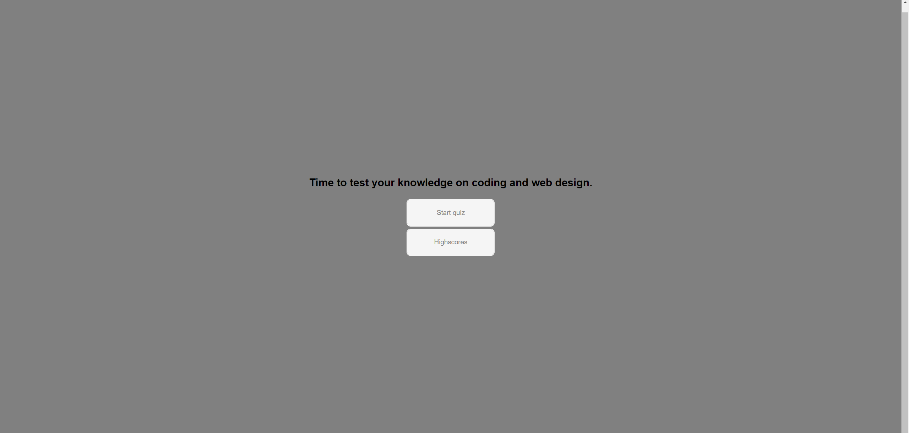
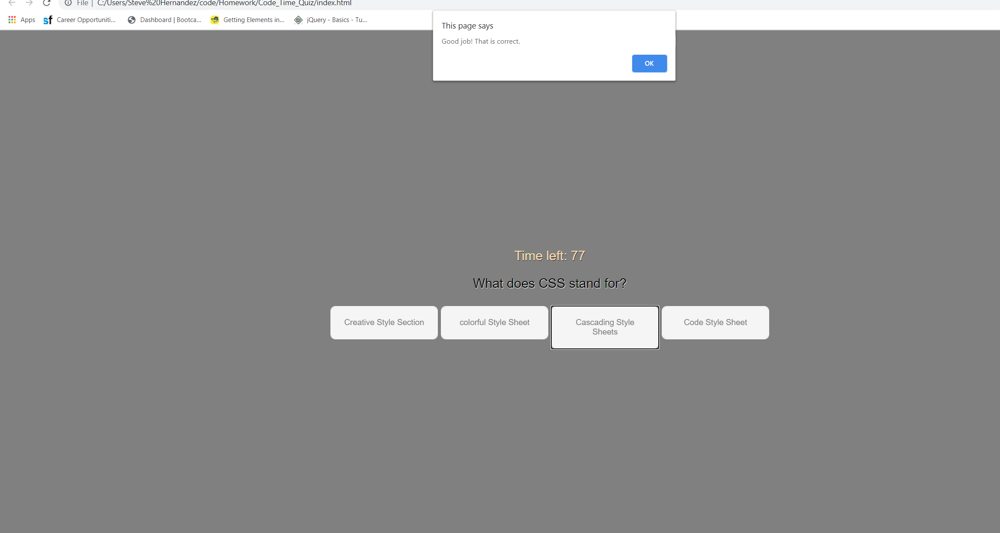
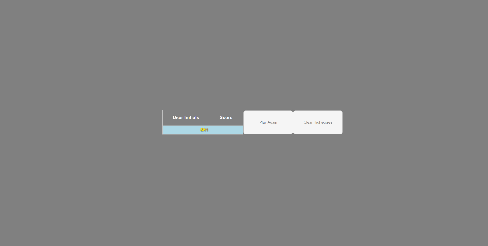

# Code_Time_Quiz
Js Time Code Quiz
This is a multiple choice 4 question timed quiz that tells the user if they got the answer correct then records and stores the users score.

General Info 
This code quiz meets the following criteria:
GIVEN I am taking a code quiz
WHEN I click the start button
THEN a timer starts and I am presented with a question
WHEN I answer a question
THEN I am presented with another question
WHEN I answer a question incorrectly
THEN time is subtracted from the clock
WHEN all questions are answered or the timer reaches 0
THEN the game is over
WHEN the game is over
THEN I can save my initials and score

